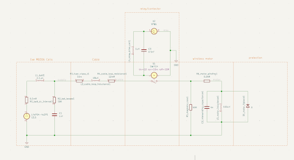

# Transient Behaviour in LiFePO₄ Marine DC Systems with Large Inductive Loads

**Matthew Quirke — April 2025**

---

## 1. System Overview

This investigation examines a 12 V marine DC system following conversion from AGM to LiFePO₄ battery banks.

The system includes high-current inductive loads:
- Windlass (bidirectional, high inrush)
- Electric winches (H-bridge control)
- Refrigeration compressors
- DC pumps and auxiliary motors

Following the upgrade, switching events became more aggressive, with:
- Sharper voltage spikes
- Increased electrical noise
- Greater stress on switching devices

The primary change was not the loads, but the removal of battery internal resistance, which previously provided damping.

*Inductive Switching Transients in LiFePO₄ System — NGSpice Simulation*

---

## 2. Primary Sources of Transients

Four mechanisms were identified as the dominant sources of transient events:

### 2.1 Inrush Current
- Motor start-up and capacitive charging (inverters)
- Rapid current rise due to low system impedance

### 2.2 Inrush with Contact Bounce
- Mechanical contactors closing under load
- Multiple rapid make/break cycles
- Produces repeated high di/dt pulses

### 2.3 Inductance in Relay / Contactor Coils
- Coil energisation and de-energisation
- Generates voltage spikes on control circuits

### 2.4 Back-EMF from Inductive Loads (PMDC motors, coils)
- Interruption of current in motors and solenoids
- Stored magnetic energy released as high voltage

These mechanisms can generate very large transient currents and voltages, often far exceeding steady-state operating conditions, particularly in low-impedance LiFePO₄ systems.

*Suggested oscilloscope captures:*
- Inrush current waveform at motor start
- Contact bounce showing multiple current spikes
- Relay coil flyback spike on control line
- Motor back-EMF spike at switch-off

---

## 3. Key System Change: Loss of Damping

LiFePO₄ batteries exhibit:
- Very low internal resistance (mΩ range)
- High instantaneous current capability
- Minimal voltage sag

Compared to AGM:
- Higher di/dt during switching
- Increased L·di/dt voltage spikes
- Reduced damping

At low frequency, the battery behaves as a stiff source.  
At high frequency, wiring inductance dominates, limiting transient absorption.

Initial di/dt is set primarily by inductance,  
but peak voltage and ringing depend on damping.

*Suggested diagrams:*
- RLC comparison: damped (AGM) vs underdamped (LiFePO₄)
- Ringing waveform comparison

**Todo:** Confirm inductive reactance of 24 m loop of 32 mm² copper cable is ~0.58 Ω at 5 kHz (primary transient frequency)

---

## 4. Observed Transient Behaviour

### 4.1 Inductive Switching Events

The largest transients were associated with:
- Windlass switching (start/stop, direction change)
- Winch H-bridge transitions
- Pump/compressor shutdown

These correspond directly to the mechanisms identified in Section 2, particularly:
- Back-EMF from motors
- Contact bounce during switching

Observed effects:
- High-voltage spikes
- Localised overvoltage at switching nodes
- Propagation into control wiring

The battery did not effectively clamp these events due to wiring inductance.

*Suggested captures:*
- Motor terminal voltage during switch-off
- Battery terminal voltage (comparison)
- Differential measurement across relay contacts

---

## 5. Engineering Impact

### 5.1 Stress Distribution

Transient energy appears primarily across:
- Contactors and relays
- Cable inductance
- Control electronics

Fast events are local, not system-wide.

---

### 5.2 Battery Stress

For a typical 100 Ah LiFePO₄ bank:
- Continuous: ~100 A (1C)
- Surge (seconds): 200–400 A (2–4C)
- Transient (ms): 1000–1200 A (10–12C)

Although currents are large:
- Duration is very short (10–30 ms)
- Total energy is low

These transients are generally within cell capability, but may exceed system limits.

---

### 5.3 BMS Behaviour

MOSFET-based BMS systems showed:
- Tolerance to short current spikes
- Occasional nuisance trips
- Sensitivity to voltage transients

The BMS is a primary vulnerability point.

---

## 6. Protection Limitations

### 6.1 Parallel Suppression Devices

TVS diodes, Schottky diodes, and RC snubbers:
- Ineffective at battery terminals for fast events
- Effective when placed at the source

**Reason:**
Wiring inductance isolates the battery at high frequency.

Correct placement is critical.

*Suggested diagram: Suppression at battery vs at load*

---

## 7. Mitigation Strategies

### 7.1 Local Energy Absorption
- Low-ESR capacitors near loads
- Distributed capacitance along cables

### 7.2 Switching Control
- Avoid switching under load where possible
- Minimise contact bounce
- Use controlled switching / pre-charge

*Suggested capture: Contact bounce transient waveform*

---

## 8. System-Level Effects

LiFePO₄ systems exhibit:
- Higher operating voltage under load
- Increased motor current
- Increased mechanical output

Resulting in:
- Increased electrical stress
- Increased mechanical stress

Most evident in windlass and winch systems.

---

## 9. Conclusion

LiFePO₄ conversion does not create transients—it removes damping, exposing them.

The dominant transient sources are:
- Inrush current
- Contact bounce
- Relay/contactor coil inductance
- Back-EMF from motors and coils

These mechanisms can produce large, fast transients that:
- Are not effectively suppressed by the battery
- Are governed by wiring inductance and local circuit behaviour

The most severe stress events arise from:
- Inductive switching
- Mechanical contact behaviour
- Abrupt current interruption

Effective mitigation requires:
- Measurement and validation
- Suppression at the source
- Improved switching control
- Careful wiring and layout design
